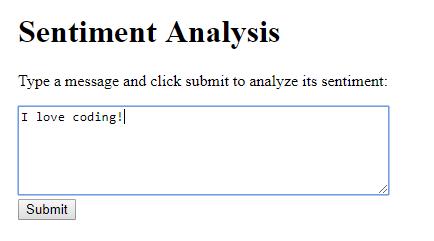
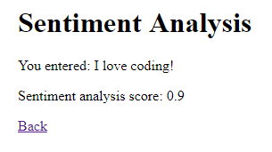

This project uses the Natural Language API in a servlet to perform sentiment analysis on text submitted by a user.






To run this example, first make sure your `GOOGLE_APPLICATION_CREDENTIALS` environment variable is set and that you've enabled the [Natural Language API](https://console.developers.google.com/apis/library/language.googleapis.com). Then execute this command:

```
mvn clean package exec:java
```

Then navigate to http://localhost:8080/index.html

Learn more at [HappyCoding.io/tutorials/google-cloud/natural-language](https://happycoding.io/tutorials/google-cloud/natural-language).