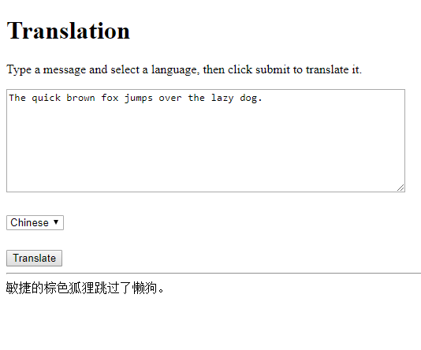

This project uses the Translation API in a servlet to translate text submitted by a user.
It uses the `fetch()` function from JavaScript to request translations, creating a minimalist version of Google Translate.



To run this example, first make sure your `GOOGLE_APPLICATION_CREDENTIALS` environment variable is set and that you've enabled the Translation API: https://console.cloud.google.com/apis/library/translate.googleapis.com

Then execute this command:

```
mvn clean package exec:java
```

Then navigate to http://localhost:8080/index.html

Learn more at [HappyCoding.io/tutorials/google-cloud/translation](https://happycoding.io/tutorials/google-cloud/translation).