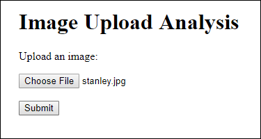
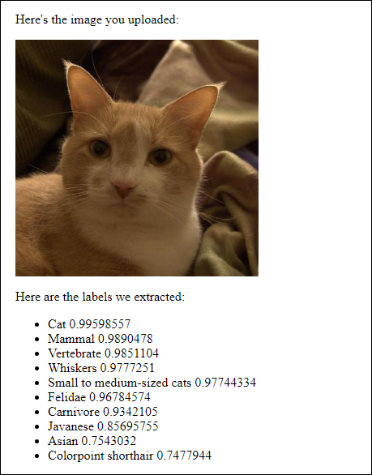

This project uses the Google Cloud Vision API in a servlet to display a list of labels for an image uploaded by the user.





To run this example, first make sure your `GOOGLE_APPLICATION_CREDENTIALS` environment variable is set and that you've enabled the [Vision API](https://console.cloud.google.com/apis/library/vision.googleapis.com), and then execute this command:

```
mvn clean package exec:java
```

Then open a web browser to `http://localhost:8080/index.html`.

Learn more at [HappyCoding.io/tutorials/google-cloud/vision](https://happycoding.io/tutorials/google-cloud/vision).