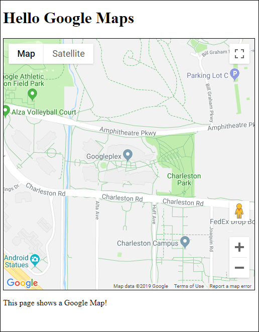

This project uses the Google Maps API to add a map to the page.

You can open the `index.html` file directly in a web browser.

Learn more at [HappyCoding.io/tutorials/google-cloud/maps](https://happycoding.io/tutorials/google-cloud/maps).